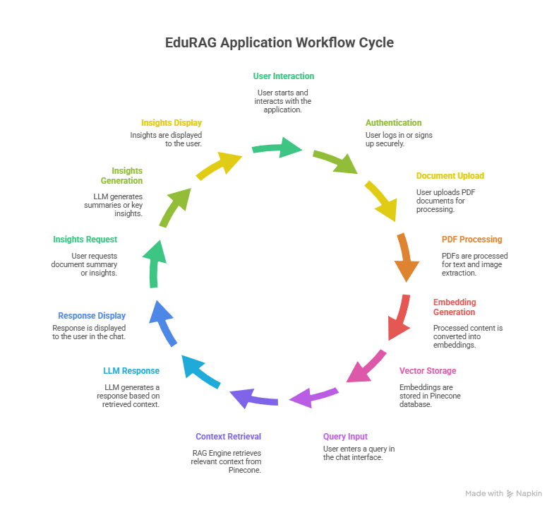
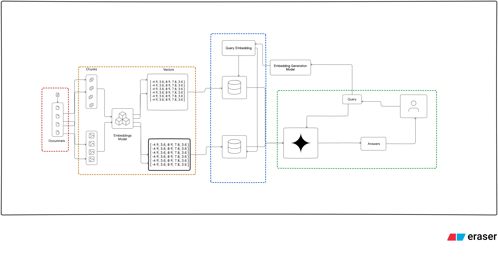
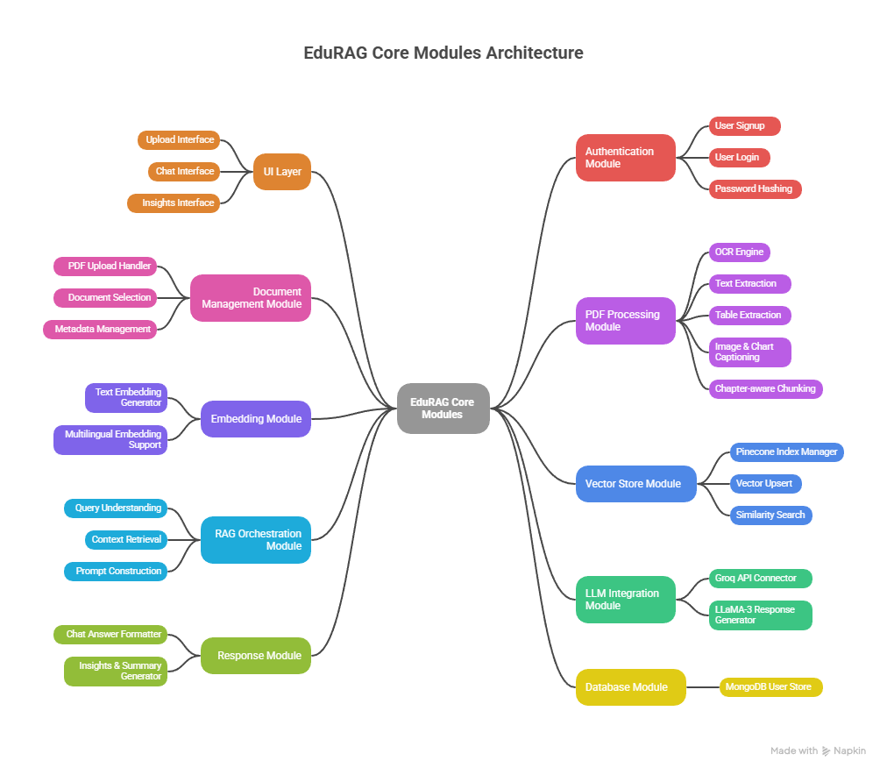

# 🏥 Intel-Unnati-Industrial-Training_PS-4 — EduRAG

EduRAG is a **document-aware intelligent assistant** built to enable **accurate question answering and insight generation from unstructured PDF documents** such as reports, manuals, policies, and research files.
The system strictly answers queries and generates insights **only from user-uploaded documents**, ensuring **no hallucination and no external knowledge leakage**.

---

## 🧠 Problem Statement

### Problem Statement – 4: Convert Enterprise PDFs into Searchable Knowledge

Enterprises maintain thousands of PDF documents such as reports, manuals, research papers, and policies. Searching for specific information inside these documents is challenging because the data is largely **unstructured** and often spread across pages, tables, and images.

The objective of this project is to build a tool that **converts PDFs into structured, searchable knowledge**, enabling efficient retrieval and accurate question answering.

### Key Requirements Addressed

- Properly read PDFs, including **scanned PDFs using OCR**, while preserving document structure and flow
- Chunk documents into **meaningful sections without breaking chapters or context**
- Store extracted textual content in a **Vector Database (Pinecone)** for semantic search
- Extract tables and store them in a **searchable vector representation** (instead of a separate NoSQL store)
- Handle images and charts by generating **short textual descriptions** so they are also searchable

### Not in Scope (as per implementation)

- Handwritten or very low-quality scan handling
- Deep data extraction from complex charts

### Stretch Goals Achieved

- ✅ **Multilingual document support** using multilingual embeddings

---

## 🧩 Solution Overview

EduRAG implements an end-to-end **PDF-to-Knowledge RAG pipeline** with user authentication. The overall flow is:

1. User authenticates into the system
2. User uploads one or more PDF documents
3. Documents are processed using OCR (if required), chunked, and indexed into Pinecone
4. User selects a document as the active context
5. User can:

   - Ask document-specific questions in the **Chat** section
   - Generate **summaries and insights** from the selected document in the **Insights** section

All responses are generated **strictly from the selected document context**, ensuring reliability and zero hallucination.

---

## 🏗️ System Architecture

### 🔹 Application Flow



### 🔹 EduRAG Document-Centric RAG System Workflow


### 🔹 RAG Workflow



### 🔹 EduRag Application Architecture


### 🔹 Core Modules



---

## 📄 Project Resources

- 📘 **Full Project Report (PDF):**
  [View Report](./assets/projectReport.pdf)

- 📊 **Project Presentation (PPT):**
  [View Presentation](./assets/projectReport.ppt)

---

## ⚙️ Tech Stack

| Layer      | Technology                      |
| ---------- | ------------------------------- |
| Backend    | FastAPI (modular architecture)  |
| Database   | MongoDB Atlas (User Management) |
| Vector DB  | Pinecone (Semantic Search)      |
| LLM        | Groq API (LLaMA-3)              |
| Embeddings | Google Generative AI Embeddings |
| Auth       | HTTP Basic Auth + bcrypt        |
| Frontend   | Streamlit (optional)            |

---

## 🧩 Core Modules

| Module      | Responsibility                               |
| ----------- | -------------------------------------------- |
| `auth/`     | User signup, login, password hashing         |
| `chat/`     | RAG-based chat logic and query answering     |
| `vectordb/` | PDF loading, chunking, and Pinecone indexing |
| `database/` | MongoDB connection and user operations       |
| `main.py`   | FastAPI entry point and route registration   |

---

## 📡 API Endpoints

| Method | Endpoint       | Description                   |
| ------ | -------------- | ----------------------------- |
| POST   | `/signup`      | Register a new user           |
| GET    | `/login`       | User login via authentication |
| POST   | `/upload_docs` | Upload PDF documents          |

---

## 🚀 Getting Started

### 1️⃣ Clone the Repository

```bash
git clone https://github.com/Ismail007-Sk/Intel-Unnati-Industrial-Training_PS-4.git
cd Intel-Unnati-Industrial-Training_PS-4
```

### 2️⃣ Create Environment Variables

Create a `.env` file in the root directory:

```env
MONGO_URI=your_mongo_uri
DB_NAME=your_db_name
PINECONE_API_KEY=your_pinecone_api_key
PINECONE_INDEX_NAME=
GOOGLE_API_KEY=your_google_api_key
GROQ_API_KEY=your_groq_api_key
```

### 3️⃣ Create Virtual Environment

```bash
uv venv
.venv/Scripts/activate
```

### 4️⃣ Install Dependencies

```bash
uv pip install -r requirements.txt
```

### 5️⃣ Run the Application

```bash
uvicorn main:app --reload
```

### 6️⃣ Run the Frontend Application

```bash
cd react_frontend
npm run dev
```

---

## 🔐 Security Features

- Secure user authentication
- Password hashing with bcrypt
- User-isolated document access
- Document-scoped context enforcement
- No external or cross-document knowledge leakage

---

## 🌱 Future Enhancements

- Handwritten and low-quality scan handling
- Advanced chart and complex table data extraction
- JWT-based authentication
- Streamlit / React frontend UI
- Document preview and download support
- Audit logs and analytics dashboard

---

## 👥 Contributors

### 👨‍💻 **Supratim Nag** — Project Lead (GenAI Developer)

- GitHub: _(https://github.com/snsupratim)_
- System design & architecture
- RAG pipeline implementation
- Backend development (FastAPI)

### 👨‍💻 **Ismail Sk** — ML / NLP Developer

- GitHub: _(https://github.com/Ismail007-Sk)_
- RAG logic & semantic retrieval
- Backend API development

### 👩‍💻 **Sanchari Biswas** — Frontend Developer

- GitHub: _(https://github.com/sanchari-0809)_
- UI development & integration
- Frontend architecture support

---

## 📊 Performance Evaluation

The system includes quantitative evaluation metrics to benchmark document processing and retrieval quality.

```text
--- RAGpdf Evaluation ---
PDF time per page (s)
PDF time per document (s)
OCR accuracy (%)
Chunking accuracy (%)
Search latency (s)
Precision / Recall / MRR
Table extraction accuracy (%)
Pinecone vector count
```

These metrics validate the efficiency, accuracy, and scalability of the EduRAG pipeline.

---

## 📜 License

This project is developed as part of **Intel Unnati Industrial Training Program (PS-4)** and is intended for educational and research purposes.

---

⭐ If you find this project useful, don’t forget to **star the repository**!
